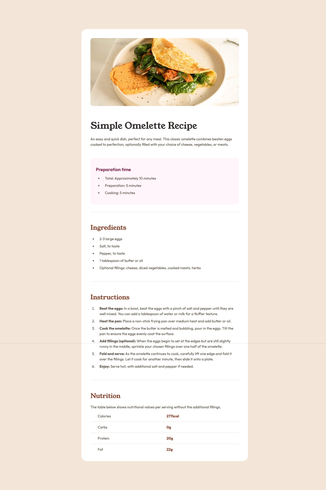

# Frontend Mentor - Recipe page solution

This is a solution to the [Recipe page challenge on Frontend Mentor](https://www.frontendmentor.io/challenges/recipe-page-KiTsR8QQKm). Frontend Mentor challenges help you improve your coding skills by building realistic projects. 

## Table of contents

- [Overview](#overview)
  - [Screenshot](#screenshot)
  - [Links](#links)
- [My process](#my-process)
  - [Built with](#built-with)

**Note: Delete this note and update the table of contents based on what sections you keep.**

## Overview

### Screenshot

### Links

- Solution URL: [Solution URL](https://github.com/juliusalberto/recipe-page-main)
- Live Site URL: [Live site](https://recipe-page-main-olive.vercel.app/)

## My process
- I used figma to see the wireframe of the website and then adjusted my design accordingly

### Built with

- Semantic HTML5 markup
- CSS custom properties
- Flexbox

